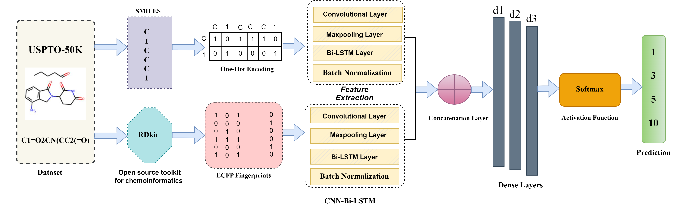

# SB-Net: Synergizing CNN and LSTM Networks for Uncovering Retrosynthetic Pathways in Organic Synthesis

SB-Net is a deep learning model designed to predict retrosynthetic pathways in organic synthesis by combining Convolutional Neural Networks (CNN) and Long Short-Term Memory (LSTM) networks. This approach leverages the strengths of CNNs for feature extraction and LSTMs for sequential data analysis, enhancing the model's ability to predict complex reactions in organic chemistry.

## Model Architecture

Below is the architecture diagram of the SB-Net model, which combines CNNs and LSTMs to improve predictions of retrosynthetic pathways in organic synthesis.

## Requirements

To run this project, make sure you have the following dependencies installed:

- **Python**: Version 3.7 to 3.10.0
- **TensorFlow**: 2.4.0
- **Rdkit**: 2023.3.2 (for molecular informatics)
- **scikit-learn**: 1.2.2
- **Other libraries**: `tqdm`, `spyder`, CUDA (for GPU acceleration)

You can install the required libraries using the following command:

## Workflow

The workflow for running this project is structured across several stages, each corresponding to a specific script:

### 1. Template Generation
- **Script**: `template.py`
- **Description**: This script generates the initial templates needed for the retrosynthetic pathway prediction.

### 2. Data Processing
- **Scripts**: `pre_processing.py`, `process.py`, `data_split.py`
- **Description**: These scripts handle the preprocessing of the dataset, cleaning the data, and splitting it into training and testing sets.

### 3. Data Augmentation
- **Script**: `Augmentation.py`
- **Description**: This script applies various augmentation techniques to increase the diversity of the training dataset, improving model robustness.

### 4. Model Training and Testing
- **Scripts**: `model_train.py`, `model_test.py`
- **Description**: These scripts train the model using the prepared dataset and test its performance.

## Citation

If you use this work in your research, please cite the following paper:

@article{mir2024sb,

  title={Sb-net: Synergizing cnn and lstm networks for uncovering retrosynthetic pathways in organic synthesis},
  
  author={Mir, Bilal Ahmad and Tayara, Hilal and Chong, Kil To},
  
  journal={Computational Biology and Chemistry},
  
  volume={112},
  
  pages={108130},
  
  year={2024},
  
  publisher={Elsevier}
  
}
